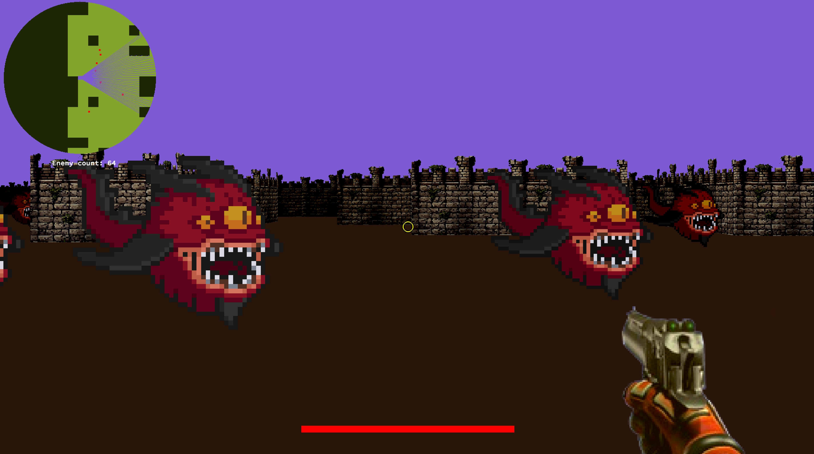

# 🕹️ cub3D – A Raycasting Maze Game in C

**cub3D** is a 42 group project that recreates a Wolfenstein-like raycasting engine using **MiniLibX** in C. Inspired by early FPS games like *Wolfenstein 3D*, the project challenges you to build a real-time renderer, handle complex user input, and manage game logic—all from scratch.

> 🎮 _This was one of the most fun and challenging projects we tackled. It took around a month and gave us deep insights into math-based rendering, project planning, and collaborative development using Git._

---



---

## 🎯 Project Goals

- Build a real-time 3D engine using **raycasting**
- Handle keyboard events and user interactions
- Work with **MiniLibX** for windowing, image drawing, and event hooks
- Develop a `.cub` file parser for scenes and maps
- Use mathematical concepts (trigonometry, projection, distances) for visual output
- Provide **instant visual feedback** that helps debug and fine-tune the game

---

## 🛠️ Features

### ✅ Mandatory Implementation

- First-person 3D view rendered with raycasting
- Custom `.cub` map file parsing
- Scene and object rendering with wall textures
- Movement: `W`, `A`, `S`, `D`
- Look: `Left` and `Right` arrow keys
- Exit: `ESC` key or clicking window close
- Clean error handling with proper messages
- Ceiling and floor coloring
- Texture support for North, South, East, and West walls

### 🗺️ Map File Requirements (`.cub`)

- Texture paths for: `NO`, `SO`, `WE`, `EA`
- Floor color: `F R,G,B`
- Ceiling color: `C R,G,B`
- Map layout at the bottom with:
  - `1` = wall
  - `0` = space
  - `N`, `S`, `E`, `W` = player start + orientation

Example:
```
NO ./textures/wall_n.xpm
SO ./textures/wall_s.xpm
WE ./textures/wall_w.xpm
EA ./textures/wall_e.xpm
F 220,100,0
C 225,30,0

111111
100001
10N001
100001
111111
```

---

## 🔧 Build and Run

### 🛠 Compilation

```bash
make
```

### ▶️ Run the Game

```bash
./cub3D maps/level1.cub
```

> Make sure to have valid `.xpm` textures and properly structured map files!

---

## 🎨 Controls

| Key         | Action               |
|-------------|----------------------|
| `W`, `A`, `S`, `D` | Move             |
| `←`, `→`           | Look left/right  |
| `ESC` or Window X  | Exit game        |

---

## 🌟 Bonus Features

- 🔁 Wall collision system
- 🗺️ Minimap
- 🚪 Doors that open/close
- 🌀 Animated sprites
- 🖱️ Mouse-based view rotation
- 🎯 HUD with weapon and health

---

## 🧠 What We Learned

- 🧮 Math in action: trigonometry, FOV, projections
- 🕹️ Event-driven rendering loops and key handling
- 💻 File parsing and memory management
- 👨‍💻 Team collaboration: merge conflicts, task distribution, and Git workflows
- 🎨 The joy of building something visual in C

---
